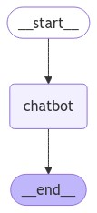
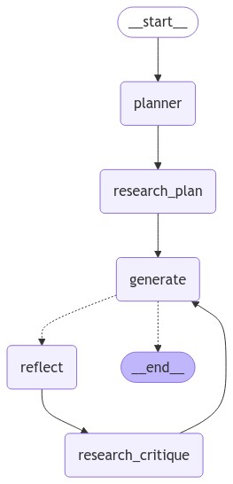

# Agents with Gemini

This project leverages **LangGraph**, **LangSmith**, and **LangChain** to implement a series of interconnected processes for chatbot interactions, reflection, and research planning. It utilizes the free tier of the **Gemini API** for language model interactions.

## Project Architecture

The project consists of several modules, each representing a key aspect of the system:

1. **Chatbot Interaction**
   ```
   _start_ -> chatbot -> _end_
   ```
<div style="display: flex; justify-content: center;">
    
</div>

2. **Reflection and Generation**
   ```
   _start_ -> generate <-> reflect -> _end_
   ```
<div style="display: flex; justify-content: center;">
    
</div>

3. **Research Planning and Critique**
   ```
   _start_ -> planner -> research_plan -> generate <-> reflect -> research_critique -> _end_
   ```
<div style="display: flex; justify-content: center;">
    
</div>

## Directory Structure

```
_langsmith
├── _pycache_
├── assets
├── chatbot_langgraph
│   ├── __init__.py
│   ├── chatbot.py
│   ├── graph.py
│   └── tavily.py
├── react
│   ├── __init__.py
│   ├── main.py
│   ├── model.py
│   ├── react_agent.py
│   ├── react_prompt.py
│   └── tools.py
├── reflection
│   ├── __init__.py
│   ├── generate.py
│   ├── graph.py
│   └── reflect_and_repeat.py
├── reflexion
│   ├── __init__.py
│   ├── classes.py
│   ├── graph.py
│   ├── nodes.py
│   └── prompts.py
├── __init__.py
```

## Setup Instructions

1. **Clone the repository**:
   ```bash
   git clone https://github.com/SadokBarbouche/agents-with-gemini.git
   ```

2. **Navigate to the project directory**:
   ```bash
   cd agents-with-gemini
   ```

3. **Install the required dependencies**:
   ```bash
   pip install -r requirements.txt
   ```

4. **Create a `.env` file** in the root directory and add your Gemini API key and other required environment variables:
   ```ini
   GOOGLE_API_KEY=""
   TAVILY_API_KEY="tvly-##"
   LANGSMITH_API_KEY=""
   LANGCHAIN_TRACING_V2=true
   LANGCHAIN_ENDPOINT="https://api.smith.langchain.com"
   LANGCHAIN_API_KEY=""
   LANGCHAIN_PROJECT="myproject"
   ```

   **Note**: Ensure you have a valid Gemini API key. This project uses the free tier of the Gemini API.

5. **Add the `.env` file to your `.gitignore`** to prevent accidentally committing sensitive data:
   ```bash
   echo ".env" >> .gitignore
   ```

6. **Run the individual modules**:

   - To run the **LangSmith** project:
     ```bash
     python -m _langsmith.main
     ```

   - To run the **Chatbot LangGraph** project:
     ```bash
     python -m chatbot_langgraph.chatbot
     ```

   - To run the **React** project:
     ```bash
     python -m react.main
     ```

   - To run the **Reflection** project:
     ```bash
     python -m reflection.graph
     ```

   - To run the **Reflexion** project:
     ```bash
     python -m reflexion.graph
     ```


